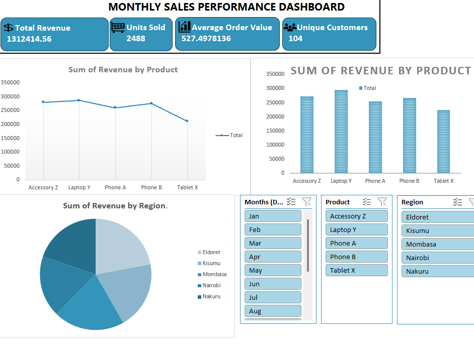

# 📊 Excel Sales Dashboard

This project showcases a professional *Excel-based Sales Dashboard* designed to provide clear insights into business performance through dynamic KPIs, slicers, and interactive charts.

## 🚀 Features

- 🔢 *KPI Cards*: Total Revenue, Units Sold, Average Order Value, Unique Customers
- 🎚 *Interactive Slicers*: Filter by Month, Product, and Region
- 📈 *Visual Charts*:
  - Line chart: Revenue trends by month
  - Bar chart: Revenue totals by product
  - Pie chart: Revenue breakdown by region
- 🧩 Built using PivotTables, PivotCharts, and Slicers
- 🎨 Clean, user-friendly layout with a modern color theme

## 🖼 Dashboard Preview

## 📁 Files Included

- Sales_Dashboard.xlsx – The main Excel file with all KPIs, slicers, and charts
- dashboard_preview.png – Screenshot of the final dashboard

## 📌 How to Use

1. *Download* or *clone* the repository
2. Open the Sales_Dashboard.xlsx file in Microsoft Excel
3. Use the slicers to filter the data by month, region, or product
4. Analyze the automatically updated KPIs and charts

## 💡 Use Case

Ideal for business analysts, data enthusiasts, and students looking to build or present a professional-level Excel dashboard with interactivity and visual insights.

## 🛠 Tools Used

- Microsoft Excel (PivotTables, Charts, Slicers)
- Basic Excel formulas
- Manual styling for layout and visual appeal

## 📬 Contact

For any feedback or suggestions, feel free to open an issue or reach out via GitHub.

---
